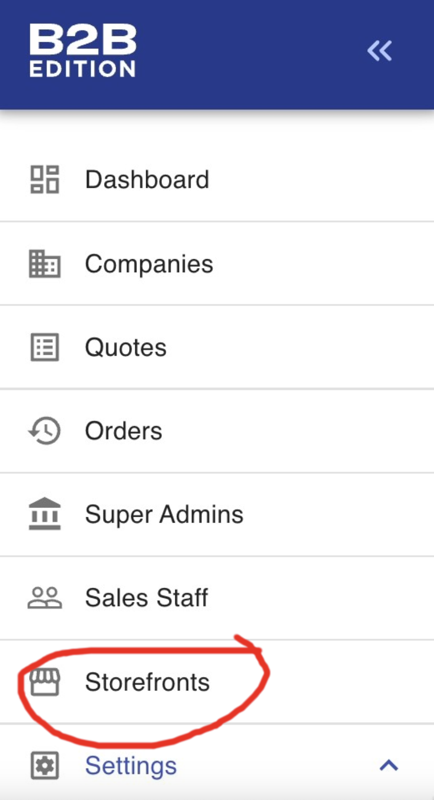

<a href="https://bundleb2b.stoplight.io/docs/openapi/quick-start" target="_blank" rel="noopener norerrer">
  
</a>

<br />
<br />

<div align="center">

[](LICENSE.md)
[](https://github.com/bigcommerce/catalyst/actions/workflows/lighthouse.yml) [](https://github.com/bigcommerce/catalyst/actions/workflows/basic.yml)

</div>

**B2B Buyer Portal** is a monorepo frontend application designed for the BigCommerce B2B Edition Buyer portal. The B2B Buyer Portal is built using [Turborepo](https://turbo.build/), [TypeScript](https://www.typescriptlang.org/), and [React](https://react.dev/).

By choosing to build on top of our Open Source B2B Buyer Portal, you'll have access to build on our B2B buyer portal application backed by a robust set of SaaS APIs. 
You can get straight to work building for your unique B2B business cases.


<p align="center">
 <a href="https://www.bigcommerce.com/solutions/b2b-ecommerce-platform/">🚀 B2B Edition</a> •
 <a href="https://developer.bigcommerce.com/community">🤗 BigCommerce Developer Community</a> •
 <a href="https://bundleb2b.stoplight.io/docs/openapi/quick-start">📝 B2B Edition API Reference</a> •
</p>


## Index

- [Index](#index)
- [☑ Prerequisites](#-prerequisites)
  - [Step 1: Access the Storefronts Manager](#step-1-access-the-storefronts-manager)
  - [Step 2: Enable B2B on Your Channel](#step-2-enable-b2b-on-your-channel)
  - [Step 3: Contact Us for Additional Support](#step-3-contact-us-for-additional-support)
- [🚀 Core Technologies](#-core-technologies)
- [📦 Workspaces](#-workspaces)
- [🛠 Tools and Libraries](#-tools-and-libraries)
- [🛠 System Setup](#-system-setup)
- [⚙ Local Development](#-local-development)
- [Running Project Locally](#running-project-locally)
- [Deploying the project](#deploying-the-project)
  - [Common issues:](#common-issues)
- [🤝 Contribution](#-contribution)
- [📞 Contact \& Support](#-contact--support)
- [License](#license)

## ☑ Prerequisites

Before you begin, ensure you have the BigCommerce B2B Edition App installed. To set up your storefront with B2B capabilities, follow the steps below:

### Step 1: Access the Storefronts Manager

After installing the B2B Edition App, go to the app's dashboard and select the 'Storefronts' section.


  
### Step 2: Enable B2B on Your Channel

Choose the channel where you wish to enable B2B functionality. Initially, B2B features can be activated on a single channel only.


### Step 3: Contact Us for Additional Support

For assistance with activating the remote buyer portal or to inquire about multi-storefront support, which allows you to utilize B2B features across multiple channels, please reach out to our team at b2b@bigcommerce.com, or raise an issue right here in this repository.

## 🚀 Core Technologies

- **Monorepo Management:** Turborepo
- **Type System:** TypeScript
- **Frontend Library:** React 18
- **Build Tool:** Vite

## 📦 Workspaces

- **Application:** `/apps/storefront` - A next-gen B2B Edition storefront application.
  - You can run multiple apps concurrently via turborepo [tasks](https://turbo.build/repo/docs/core-concepts/monorepos/running-tasks).
- **Packages:**
  - `/packages/eslint-config-b3` - Shared ESLint configurations.
  - `/packages/tsconfig` - Shared TypeScript configurations.
  - `/packages/ui` - A collection of UI components built by B3.
  - `/packages/store` - A collection of shared store logic.
  - `/packages/b3global` - A collection of shared global logic.

## 🛠 Tools and Libraries

- **Linting:** ESLint
- **Commit Standards:** commitlint
- **Git Workflow Tools:** Husky, lint-staged
- **UI Framework:** MUI 5
- **Routing:** React Router 6

## 🛠 System Setup

- **Node:** Ensure you have Node.js version >=18.0.0.
- **Package Manager:** This project uses Yarn v1.22.17.

## ⚙ Local Development

1. Installation of Node and Yarn.
   - For Node, we recommend using [nvm](https://github.com/nvm-sh/nvm).
   - Once Node is installed, you can install Yarn by using `npm i -g yarn`. If you'd rather use `pnpm`, visit this [guide](https://dev.to/andreychernykh/yarn-npm-to-pnpm-migration-guide-2n04).
2. Clone the repository.
3. Install dependencies using `yarn`.
4. Copy environment variables: `cp apps/storefront/.env-example apps/storefront/.env`.
5. Update the following values in `.env`:

- `VITE_CHANNEL_ID`: The ID of the channel to use for the storefront.
- `VITE_STORE_HASH`: The hash of the store to use for the storefront.
- `VITE_ASSETS_ABSOLUTE_PATH`: For deployment, set this to the absolute path of the hosted compiled assets.

Environment variables have been updated so you can run your UI directly into production storefronts.

6. Start the development server: `yarn RUN dev`.

## Running Project Locally

1. Activate store channel in the Channels Manager.
2. Configure header and footer scripts:

- Navigate to Channels Manager -> Scripts.
- Add two scripts (e.g., B2BEdition-header, B2BEdition-footer). Ensure you set the correct port for your localhost in the script URLs.
- Edit the header script:

```html
<script>
  {{#if customer.id}}
  {{#contains page_type "account"}}
  var b2bHideBodyStyle = document.createElement('style');
  b2bHideBodyStyle.id = 'b2b-account-page-hide-body';
  b2bHideBodyStyle.innerHTML = 'body { display: none !important }';
  document.head.appendChild(b2bHideBodyStyle);
  {{/contains}}
  {{/if}}

  // preload the vite server for local development
  fetch("http://localhost:3001/");
</script>
<script type="module">
  import RefreshRuntime from 'http://localhost:3001/@react-refresh'
  RefreshRuntime.injectIntoGlobalHook(window)
  window.$RefreshReg$ = () => {}
  window.$RefreshSig$ = () => (type) => type
  window.__vite_plugin_react_preamble_installed__ = true
</script>
<script type="module" src="http://localhost:3001/@vite/client"></script>
<script
  type="module"
  src="http://localhost:3001/index.html?html-proxy&index=0.js"
></script>
```

- Edit the footer script:

```html
<script type="module" src="http://localhost:3001/src/main.ts"></script>
```

3. Verify correct values in the .env file, especially the client_id for the draft app.

4. For local debugging, set VITE_LOCAL_DEBUG to false in .env.

5. Visit the storefront and attempt to sign in.

6. For cross-origin issues, update URL variables in .env to use the tunnel URL with HTTPS.

Note: If linters aren't functional, run `yarn prepare` first.

## Deploying the project

Building your buyer portal application requires you to run the `yarn build:production` command. This command will generate a `dist` folder in the `apps/storefront` directory and inside an `assets` folder containing the compiled assets.

**_Before building, make sure you have updated your `VITE_ASSETS_ABSOLUTE_PATH` variable pointing to where the assets folder is hosted as we'll be using this to generate the correct asset paths for the application when its mounted._**

Once you have uploaded the contents of the `dist` folder to your hosting provider, you'll have to create a footer script in your BigCommerce storefront that points to the built files generated in the `dist` folder. The contents of the script are the same as the footer script B2B Edition installs in your store, but with the updated paths. It should look something like this:

```html
<script>
  window.b3CheckoutConfig = {
    routes: {
      dashboard: '/account.php?action=order_status',
    },
  }
  window.B3 = {
    setting: {
      store_hash: '<YOUR_STORE_HASH>',
      channel_id: '<YOUR_CHANNEL_ID>',
      b2b_url: 'https://api-b2b.bigcommerce.com',
      captcha_setkey: '6LdGN_sgAAAAAGYFg1lmVoakQ8QXxbhWqZ1GpYaJ',
    },
    'dom.checkoutRegisterParentElement': '#checkout-app',
    'dom.registerElement':
      '[href^="/login.php"], #checkout-customer-login, [href="/login.php"] .navUser-item-loginLabel, #checkout-customer-returning .form-legend-container [href="#"]',
    'dom.openB3Checkout': 'checkout-customer-continue',
    before_login_goto_page: '/account.php?action=order_status',
    checkout_super_clear_session: 'true',
    'dom.navUserLoginElement': '.navUser-item.navUser-item--account',
  }
</script>
<script
  type="module"
  crossorigin=""
  src="<YOUR_APP_URL_HERE>/index.*.js"
></script>
<script
  nomodule=""
  crossorigin=""
  src="<YOUR_APP_URL_HERE>/polyfills-legacy.*.js"
></script>
<script
  nomodule=""
  crossorigin=""
  src="<YOUR_APP_URL_HERE>/index-legacy.*.js"
></script>
```

Replace `<YOUR_APP_URL_HERE>` with the URL where your build is hosted, `<YOUR_STORE_HASH>` and `<YOUR_CHANNEL_ID>` with its respective values. Replace the `*` in the file names with the generated hash from the build step.

Also, you'll have to input the following header script:

```html
<script>
  var b2bHideBodyStyle = document.createElement('style')
  b2bHideBodyStyle.id = 'b2b-account-page-hide-body'
  const removeCart = () => {
    const style = document.createElement('style')
    style.type = 'text/css'
    style.id = 'b2bPermissions-cartElement-id'
    style.innerHTML =
      '[href="/cart.php"], #form-action-addToCart, [data-button-type="add-cart"], .button--cardAdd, .card-figcaption-button, [data-emthemesmodez-cart-item-add], .add-to-cart-button { display: none !important }'
    document.getElementsByTagName('head').item(0).appendChild(style)
  }
  removeCart()
</script>
```

### Common issues:

- **Cross-Origin Issues:** If you encounter cross-origin issues, ensure you have the correct URLs in your `.env` file and verify that your store's origin URL is allowed. You can use a tunnel service like [ngrok](https://ngrok.com/) to expose your local server to the internet.
- **Environment Variables:** Ensure you have the correct environment variables set in your `.env` file. These variables are used to configure your application for different environments.
- **Header and Footer Scripts:** Ensure you have the correct header and footer scripts set in your BigCommerce store. These scripts are used to load your application into the storefront.
- **Build Errors:** If you encounter build errors, ensure you have the correct dependencies installed and that your project is set up correctly. You can run `yarn prepare` to ensure all dependencies are installed and up to date.

## 🤝 Contribution

For developers wishing to contribute, ensure all PRs meet the linting and commit message standards.

## 📞 Contact & Support

For queries, issues, or support, reach out to us at b2b@bigcommerce.com or open an issue in this repository.

## License

MIT
