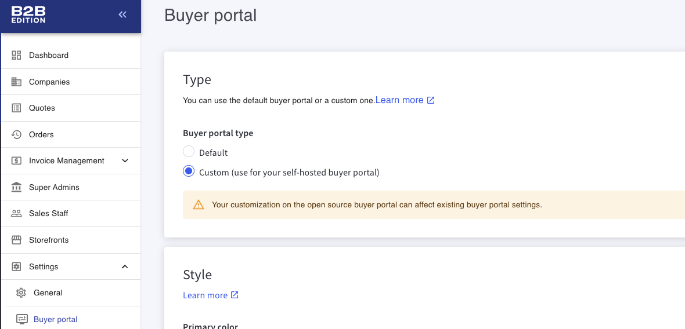
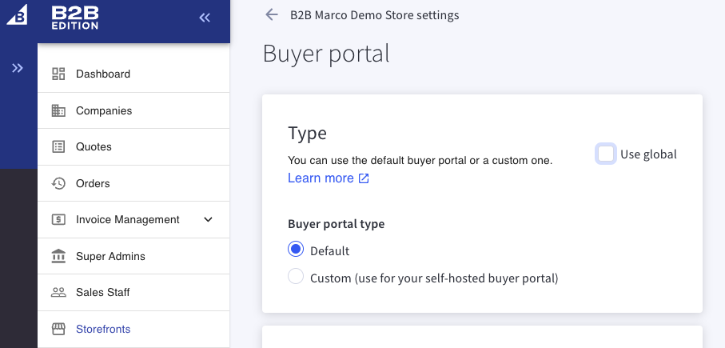

# Stencil Guide

## Running Project Locally

1. Activate store channel in the Channels Manager.
2. Configure header and footer scripts:
  - Navigate to Channels Manager -> Scripts.
  - Delete the scripts: with the following names:
    - `B2BEdition Header Script`
    - `B2BEdition Footer Script`
  - Add a the header script with the following values
    - Name: `B2B Edition Header Script`
    - Location: `Header`
    - Pages: `All Pages`
    - Category: `Essential`
    - Content:
```html
<script>
  {{#if customer.id}}
  {{#contains page_type "account"}}
  var b2bHideBodyStyle = document.createElement('style');
  b2bHideBodyStyle.id = 'b2b-account-page-hide-body';
  b2bHideBodyStyle.innerHTML = 'body { display: none !important }';
  document.head.appendChild(b2bHideBodyStyle);
  {{/contains}}
  {{/if}}
</script>
<script type="module">
  import RefreshRuntime from 'http://localhost:3001/@react-refresh'
  RefreshRuntime.injectIntoGlobalHook(window)
  window.$RefreshReg$ = () => {}
  window.$RefreshSig$ = () => (type) => type
  window.__vite_plugin_react_preamble_installed__ = true
</script>
<script type="module" src="http://localhost:3001/@vite/client"></script>
```
  - Add a the footer script with the following values
    - Name: `B2B Edition Footer Script`
    - Location: `Footer`
    - Pages: `All Pages`
    - Category: `Essential`
    - Content:
```html
<script type="module" src="http://localhost:3001/src/main.ts"></script>
<script>
  window.B3 = {
    setting: {
      store_hash: '{{settings.store_hash}}',
      channel_id: {{settings.channel_id}},
      platform: 'bigcommerce', // override this depending on your store channel platform: https://developer.bigcommerce.com/docs/rest-management/channels#platform
    },
  }
</script>
```

3. Configure the following `.env` values:
  - set `VITE_LOCAL_DEBUG` to `false`
4. Navigate to the B2B Edition App Dashboard and set the following values:
  - Global Config: In B2B Edition App dashboard -> Settings -> Buyer Portal for global config

  - Or B2B Edition App dashboard -> Storefront -> Desired channel -> Buyer Portal for specific channel config
 [alt text](README.md)


6. Visit the headless storefront and attempt to sign in.

**FAQs:**
- linters are not working: run `yarn prepare` first.
- `cross-origin` issues: update URL variables in .env to make sure api calls are using your tunnel URL with HTTPS.

## Deploying the project

Building your buyer portal application requires you to run the `yarn build` command. This command will generate a `dist` folder in the `apps/storefront` directory and inside an `assets` folder containing the compiled assets.

Make sure that you have configured the following `.env` values correctly before building:

- `VITE_ASSETS_ABSOLUTE_PATH`: Set this to the URL where the assets folder is hosted. **Note that this needs to be the absolute URL to the `/assets` folder location where the build will be served from in production.** Also please include the trailing `/`.

  For example, if you deploy the contents of the `dist` folder built by running `yarn build` and hosted it at https://my.custom.cdn/generated/b2b, the value you should put is https://my.custom.cdn/generated/b2b/assets/.

Once you have uploaded the contents of the `dist` folder to your hosting provider, you need to update your scripts in your BigCommerce storefront that points to the newly uploaded files.

- Footer Script Contents:
```html
<script>
  window.b3CheckoutConfig = {
    routes: {
      dashboard: '/account.php?action=order_status',
    },
  }
  window.B3 = {
    setting: {
      store_hash: '<YOUR_STORE_HASH>',
      channel_id: '<YOUR_CHANNEL_ID>',
      platform: 'headless',
      b2b_url: 'https://api-b2b.bigcommerce.com',
      captcha_setkey: '6LdGN_sgAAAAAGYFg1lmVoakQ8QXxbhWqZ1GpYaJ',
    },
    'dom.checkoutRegisterParentElement': '#checkout-app',
    'dom.registerElement':
      '[href^="/login.php"], #checkout-customer-login, [href="/login.php"] .navUser-item-loginLabel, #checkout-customer-returning .form-legend-container [href="#"]',
    'dom.openB3Checkout': 'checkout-customer-continue',
    before_login_goto_page: '/account.php?action=order_status',
    checkout_super_clear_session: 'true',
    'dom.navUserLoginElement': '.navUser-item.navUser-item--account',
  }
</script>
<script
  type="module"
  crossorigin=""
  src="<YOUR_APP_URL_HERE>/index.*.js"
></script>
<script
  nomodule=""
  crossorigin=""
  src="<YOUR_APP_URL_HERE>/polyfills-legacy.*.js"
></script>
<script
  nomodule=""
  crossorigin=""
  src="<YOUR_APP_URL_HERE>/index-legacy.*.js"
></script>
```

Replace the following values:
- `<VITE_ASSETS_ABSOLUTE_PATH>` with the value you used for the environment variable `VITE_ASSETS_ABSOLUTE_PATH` (where your build is hosted)
- `<YOUR_STORE_HASH>` with your store hash
- `<YOUR_CHANNEL_ID>` with the headless channel id

- Header Script Contents:
```html
<script>
  {{#if customer.id}}
  {{#contains page_type "account"}}
  var b2bHideBodyStyle = document.createElement('style');
  b2bHideBodyStyle.id = 'b2b-account-page-hide-body';
  b2bHideBodyStyle.innerHTML = 'body { display: none !important }';
  document.head.appendChild(b2bHideBodyStyle);
  {{/contains}}
  {{/if}}
</script>
```