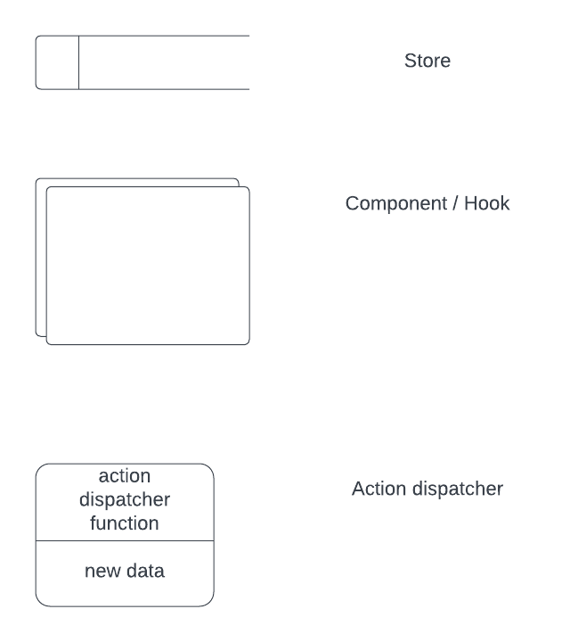
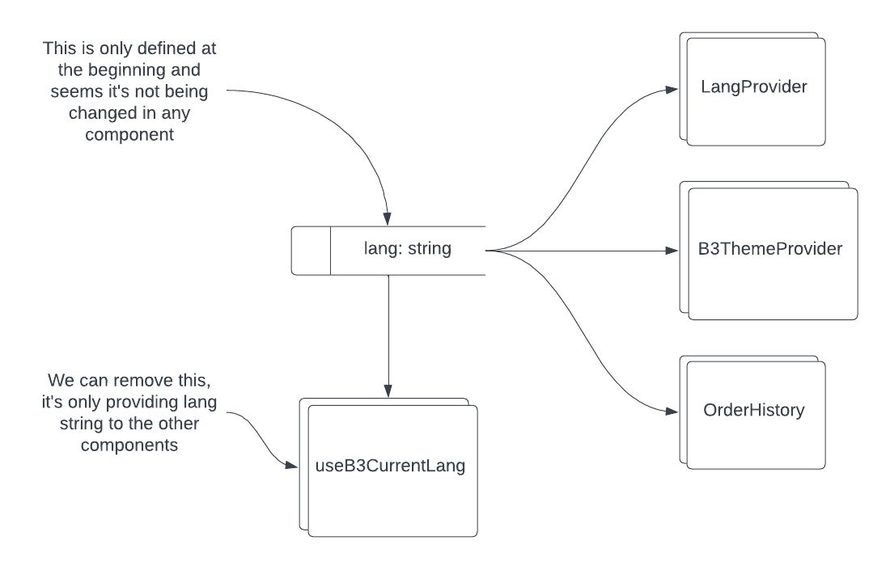
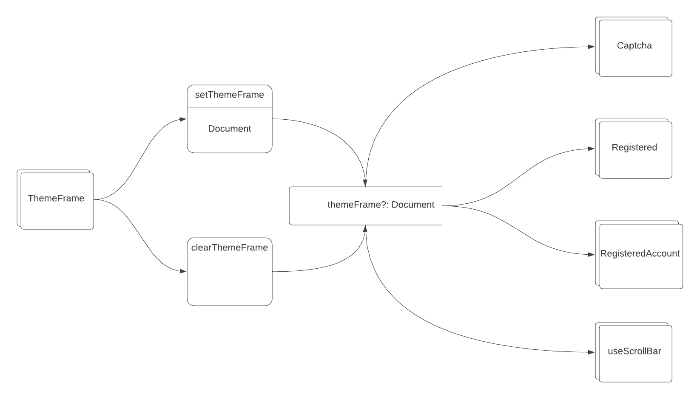

# Migrate context stores to redux slices

## Terminology / Definitions

- Redux store: It's like a big container that holds all the important data for the web application in one place. It keeps track of the state of the application, which means it knows things like what data is currently being displayed on the screen and what actions users have taken.
- Redux slices: they are a feature of the Redux toolkit that allows us to define a small piece of the application's state and the reducers that update that state. Think of a Redux slice as a mini Redux store. It contains its own state, reducer functions, and action creators, all focused on a specific piece of the application's data.

## What problem are you trying to solve?

Using React context to store data could be helpful at the beging, cause while the main focus at that moment was keep the smallest bundle size to make smaller loading times, using the lazy loading strategy help us to improve. But they're recommended for small pieces of information and reading the initial state of these contexts we can say that there are complex objects stored, this could lead to different errors:

- Performance: Storing large or complex objects in React Context can impact performance, particularly when multiple components are consuming the same context. Every time the context is updated, all the components that depend on it will re-render, which can slow down the application.
- Serialization: React Context uses the context provider and consumer components to pass data between components. However, not all data types can be serialized and passed between components, particularly if they contain functions or circular references. This can cause errors when we try to access the data from a consumer component.
- Unintentional Sharing: When we store complex objects in React Context, it's possible that multiple components might modify the same object at the same time, leading to unintended side effects. This can make it harder to debug the application and may lead to unexpected behavior.

## How are you trying to solve it and why?

Redux Toolkit provides a number of features that can help us avoid the potential problems that can arise when storing complex data in React Context:

- Performance: Redux Toolkit's store is optimized for performance, using an efficient diffing algorithm to minimize the number of components that need to re-render when the store is updated. This can help prevent performance issues when managing complex state.
- Serialization: Redux Toolkit includes a utility function called `createSlice` that makes it easy to define slices of state that are serializable. This ensures that the state stored in the Redux store can be easily passed between components, without causing errors or unexpected behavior.
- Predictable State Changes: Redux Toolkit's store uses a strict unidirectional data flow, which means that the state can only be updated through actions that are dispatched to the store. This helps prevent unintended side effects by ensuring that state changes are predictable and easy to track.

Overall, Redux Toolkit is a better choice for managing complex state, because it provides a well-defined, optimized, and predictable way to manage and update state in the application. It can help us avoid the potential issues that can arise when storing complex data in React Context, and provide a more efficient and maintainable way to manage the application's state.

**As first step we should migrate `themeFrame` and `lang` contexts to Redux slices**

### Risks

Migrating from React Context to Redux Toolkit can be a complex process, and there are a number of risks that we should be aware of:

- Learning Curve: Redux Toolkit has a steeper learning curve than React Context, especially if we're not familiar with Redux or other state management libraries. We may need to spend time learning the concepts and best practices of Redux before we can migrate the code.
- Code Changes: Migrating to Redux Toolkit will likely require significant changes to the code. We'll need to update our state management logic to use Redux Toolkit's store, actions, and reducers, and we may need to update the component's code to use Redux Toolkit's `useSelector` and `useDispatch` hooks.
- Performance: While Redux Toolkit can provide better performance than React Context in some cases, it's possible to create performance issues if we don't use it correctly.We'll need to make sure we're using Redux Toolkit's optimized features, such as memoized selectors, to prevent unnecessary re-renders and improve performance.

### Benefits

Migrating from React Context to Redux Toolkit can offer several benefits:

- Centralized State Management: Redux Toolkit provides a centralized store for managing application state, which can make it easier to share data between components and keep the code organized.
- Predictable Data Flow: Redux Toolkit enforces a strict unidirectional data flow, which can make it easier to reason about how data is passed between components and prevent unintended side effects.
- Optimized Performance: Redux Toolkit uses an optimized diffing algorithm to minimize unnecessary re-renders and improve performance. Additionally, Redux Toolkit provides memoized selectors that can help prevent unnecessary re-renders and improve performance.
- Improved Debugging: Redux Toolkit provides a time-traveling debugger called `Redux DevTools` that makes it easy to track changes to the store and debug issues.
- Community Support: Redux has a large and active community of developers, which means we can find plenty of resources and support when working with Redux Toolkit.
- Compatibility with Third-Party Libraries: Many popular React libraries and frameworks are designed to work with Redux, which means that we may be able to find pre-built components and integrations that work with Redux Toolkit.

### Language

We will be using JavaScript as the main language with JSX on the React components where will be provided the stored data

### Dependencies

| Dependency / Integration Point |                 Why?                 |     How?     | Required work on the integration end? |
| :----------------------------: | :----------------------------------: | :----------: | :-----------------------------------: |
|         BundleB2B API          | Storefront buyer portal use this API | REST/Graphql |       None, it's just consumed        |

## Impact Areas

## Architecture Diagram

